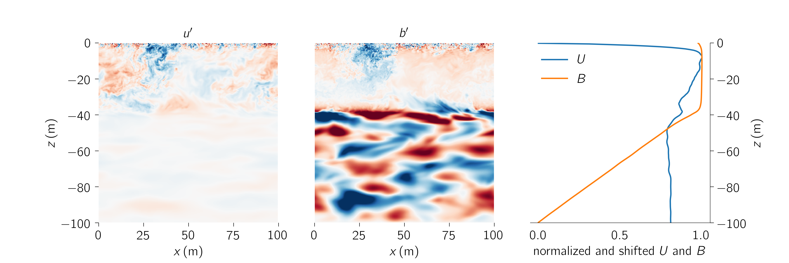

# An ocean column model optimzation project

We are attempting to optimize column models for the turbulent ocean surface boundary layer.

At the same time, we are developing a framework for evaluating the 'fidelity' of parameterizations.

Our method is to estimate the optimal parameters (and their pdf's) by comparing three-dimensional high-resolution simulation data to solutions to a "column model" --- a model that approximates the effect of three-dimensional fluctuations on the horizontally-averaged dynamics of high-resolution simulation with a turbulence closure.

An example of the kind of data we will use to optimze column models is shown below.

This project is part of the Climate Modeling Alliance.
